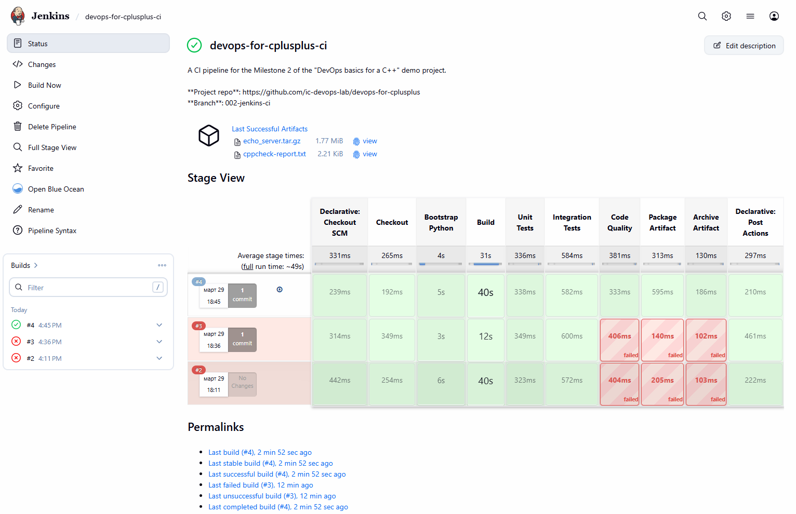
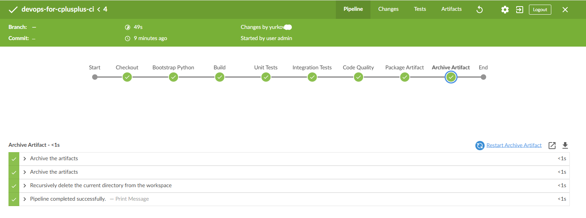
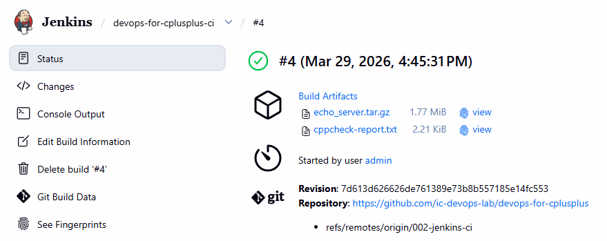

# A Lab for practicing DevOps basics for a C++ project

This project is inspired by real-world CI/CD challenges for distributed Linux-based systems.

## Project goal

This repository demonstrates a minimal but realistic CI setup for a C++ service:

- build and test automation (CMake + pytest)
- Jenkins-based CI pipeline
- reproducible Jenkins provisioning on AWS using Terraform

The goal is to simulate a production-like CI environment for non-Java services.

---

## Row plan

- one clean C++ service
- one excellent Jenkins pipeline
- one deployment model without containers first
- one deployment model with containers second
- one simple self-update mechanism as a stretch goal

---

## For a start we had

- small C++ REST service with:
  - GET /health
  - GET /version
  - GET /config
  - POST /echo
- CMake project
- unit tests with GoogleTest
- Python integration tests

All the initial code is generated by AI. The goal is to showcase how to support C++ app from a DevOps perspective, not diving to C++ development.

---

## Desired Architecture

- DevOps VM: used for development and testing
- Jenkins VM: runs CI pipelines
- Targets: future deployment nodes (planned in next milestones)

---

## Project organization

Project stages (milestones) will be saved as branches. The main branch duplicates the most recent project stage.

**Current stage**: Milestone 2 — Jenkins CI on AWS\
**Branch**: 002-jenkins-ci

**Previous stages**:
- [Milestone 1: Local Setup](./readme-ms001.md) / branch: 001-local-setup

---

# Milestone 2 — Jenkins CI on AWS

## Objective

Introduce a **dedicated Jenkins CI server on AWS** and connect it to the existing C++ service project.

This milestone is intentionally limited to **continuous integration**, not full deployment.

---

## Scope

- provision a dedicated **Jenkins EC2 instance** with Terraform
- install Jenkins and required build tools on that VM
- install a minimal, justified set of Jenkins plugins
- create the first Jenkins pipeline that:
  - builds the project
  - runs unit tests
  - runs Python integration tests
  - runs lightweight code quality checks
  - packages the application
  - archives the artifact in Jenkins for download

**Not included yet**
- deployment to target VMs
- Docker-based delivery
- self-update logic
- SonarQube or other external quality platforms
- multibranch or advanced job orchestration

**Limitations**
- Jenkins runs builds on the controller node
- no distributed agents yet
- no deployment stage

---

## Project Structure

```
autonomy-cicd-lab/
  CMakeLists.txt
  readme.md
  app/
    src/
      main.cpp
      config.cpp
      echo_logic.cpp
      version.cpp
    include/
      config.hpp
      echo_logic.hpp
      version.hpp
    tests/
      unit/
        test_config.cpp
        test_echo_logic.cpp
      integration/
        test_api.py
  docs/
  infra/
    terraform/
      modules/
      userdata/
  tools/
    python_helper/
      requirements.txt
  scripts/
    bootstrap.sh
    build.sh
    test.sh
    run_local.sh
    install_service.sh
    service_control.sh
```

For now, the important split is:
- `app/src` and `app/include` → the service
- `app/tests/unit` → C++ unit tests
- `app/tests/integration/test_api.py` → Python integration tests
- `CMakeLists.txt` → build definition
- `scripts/*.sh` → local workflow wrappers

---

## High-level architecture

```text
Developer
   |
   v
GitHub repository
   |
   v
Jenkins on AWS EC2
   |
   +-- checkout source
   +-- build with CMake
   +-- run unit tests
   +-- run Python integration tests
   +-- run code quality checks
   +-- package artifact
   +-- archive artifact in Jenkins
```

---

## A dedicated Jenkins VM

Jenkins will run on its own EC2 instance because that reflects a cleaner and more realistic separation of concerns.

Benefits:
- isolated CI server lifecycle
- independent sizing from application hosts
- easier future expansion
- cleaner security group and access model
- easier explanation of architecture

This also prepares the project for later milestones where Jenkins will coordinate builds and deployments into separate target environments.

---

## Minimal Jenkins plugins and why they matter

Only a small plugin set is needed at this stage.

### Pipeline
Enables pipeline-as-code through `Jenkinsfile`.

Why needed here:
- the pipeline definition should live in the repository
- pipeline changes should be versioned like application code

### Git
Allows Jenkins to clone and checkout repository contents.

Why needed here:
- Jenkins must pull the project source before building it

### Credentials
Secure storage for tokens, passwords, and SSH keys.

Why needed here:
- useful immediately if the repository is private
- essential later for deployment credentials and registry access

### Pipeline: Stage View
Adds a basic stage visualization in the Jenkins UI.

Why needed here:
- makes it easier to see which stage failed
- useful while learning and debugging

### Blue Ocean
Provides a more modern UI for viewing and debugging pipelines.

Why it can help:
- better stage visualization
- clearer navigation through pipeline runs
- easier log inspection by stage
- good for demo value when showing the project

Important note:
Blue Ocean is not required for Jenkins to work. It is mainly a usability improvement. For this project it is worth including because it makes the pipeline easier to understand and present.

### Warnings Next Generation
Collects and visualizes static analysis results.

Why needed here:
- useful when adding `cppcheck` or `clang-tidy`
- allows quality checks to become visible in Jenkins instead of only appearing in console logs

---

## Code quality in this milestone

A full quality platform such as SonarQube would require additional infrastructure and would expand the milestone too much.

So Milestone 2 will use **lightweight local checks inside the Jenkins pipeline**, for example:
- `clang-format` check
- `cppcheck`
- optionally `clang-tidy`

This is enough to demonstrate:
- quality gates exist
- C++ code is not only compiled but also checked
- Jenkins can publish or at least report quality findings

That keeps the milestone focused.

---

## First pipeline scope

The first pipeline should remain minimal and reliable.

### CI pipeline stages

1. Checkout source code
2. Build C++ application using CMake
3. Run unit tests
4. Run Python integration tests
5. Run code quality checks (cppcheck, clang-format)
6. Package binary artifact
7. Archive artifact in Jenkins

---

### Result
A user should be able to open Jenkins and:
- see a successful pipeline run
- inspect logs
- inspect stage results
- download the produced artifact

---

## Artifact strategy

At this stage the artifact does not need an external repository yet.

Jenkins artifact archiving is enough.

Example artifact:
- `echo_server.tar.gz`

Why this is enough for now:
- proves packaging works
- proves the pipeline produces a reusable build output
- gives a clean base before introducing external artifact storage later

---

## Runbook

Checkout:
- [Jenkins runbook for Milestone 2](./docs/ms002-runbook-jenkins.md)
- [Jenkins pipeline design runbook](./docs/ms002-pipeline-design.md)

---

## Definition of done

Milestone 2 is complete when:

- Jenkins VM is provisioned through Terraform
- Jenkins is reachable and usable
- required plugins are installed
- Jenkins can pull the repository
- pipeline builds the project successfully
- pipeline runs tests successfully
- pipeline performs code quality checks
- pipeline archives an artifact for download
- documentation clearly explains the chosen design

How it should look like in Jenkins:
---

*The las pipeline run is successful*
---

*Successful pipeline run showing all stages completed*
---

*Downloadable binary is available after the pipeline is completed*

---

## Expected next milestone after this one

Milestone 3 should build on this CI base and introduce the first deployment workflow.

That progression is intentional:

- Milestone 1 → local build/test/service lifecycle
- Milestone 2 → Jenkins CI on AWS
- Milestone 3 → deployment from Jenkins to target Linux hosts

---