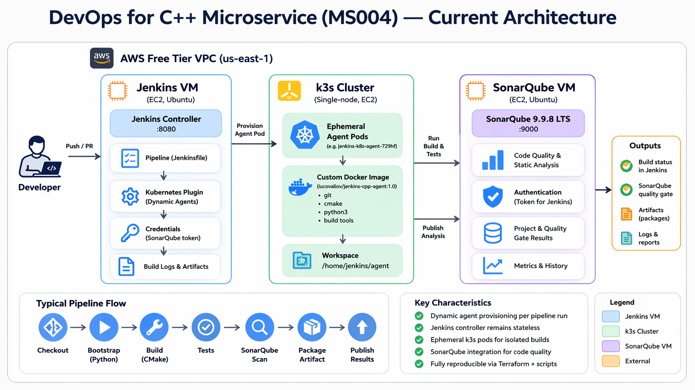

# A Lab for practicing DevOps basics for a C++ project

This project is inspired by real-world CI/CD challenges for distributed Linux-based systems.

## Project goal

This repository demonstrates a minimal but realistic CI setup for a C++ service:

- build and test automation (CMake + pytest)
- Jenkins-based CI pipeline
- SonarQube Quality Gate
- reproducible Jenkins/SonarQube provisioning on AWS using Terraform

The goal is to simulate a production-like CI environment for non-Java services.

---

## Rough plan

- one clean C++ service
- one excellent Jenkins pipeline
- one deployment model without containers first
- one deployment model with containers second
- one simple self-update mechanism as a stretch goal

---

## Starting point

- small C++ REST service with:
  - GET /health
  - GET /version
  - GET /config
  - POST /echo
- CMake project
- unit tests with GoogleTest
- Python integration tests

The goal is to showcase how to support a C++ app from a DevOps perspective, not to dive into C++ development.

---

## Desired Architecture

- DevOps VM: used for development and testing
- Jenkins VM: runs CI pipelines
- Targets: future deployment nodes (planned in next milestones)

---

## Project organization

Project stages (milestones) will be saved as branches. The main branch duplicates the most recent project stage.

**Current stage**: Milestone 4 — Dynamic Jenkins Agents on Kubernetes\
**Branch**: 004-jenkins-agents

**Previous stages**:
- [Milestone 1: Local Setup](./readme-ms001.md) / branch: 001-local-setup
- [Milestone 2 — Jenkins CI on AWS](./readme-ms002.md) / branch: 002-jenkins-ci
- [Milestone 3 — SonarQube Integration](./readme-ms003.md)

---

# Milestone 4 — Dynamic Jenkins Agents on Kubernetes

This milestone moves Jenkins build execution off the controller VM and onto **ephemeral Kubernetes-based agents**.

The goal is not to redesign the whole project around Kubernetes, but to extend the existing Jenkins setup with a more realistic execution model:

- Jenkins controller remains the orchestration layer
- a dedicated k3s VM provides Kubernetes execution capacity
- Jenkins provisions agent pods dynamically
- the pipeline runs on ephemeral agents instead of the controller itself

This milestone is based on the current project state after Milestone 3.

---

## Why this milestone exists

The project originally focused on CI/CD around a C++ service.
The current direction extends that into **CI platform engineering**.

Many real Jenkins environments do not run builds on the controller node.
Instead, they use:

- dedicated static agents
- or dynamic agents provisioned on demand

This milestone implements the second model.

That makes the setup much closer to modern CI practice and aligns well with roles involving:

- Jenkins pipeline engineering
- Jenkins build node management
- Kubernetes-based CI infrastructure
- scalable containerized build execution

---

## Objective

Introduce **Jenkins dynamic agents running on k3s** using the Jenkins Kubernetes plugin and a custom Docker-based agent image.

By the end of this milestone:

- Jenkins controller should connect to k3s
- Jenkins should provision agent pods on demand
- the pipeline should run on Kubernetes agents
- concurrent builds should create multiple agent pods
- the build should no longer run on the Jenkins controller VM

---

## Scope

Included:

- one dedicated k3s VM provisioned with Terraform
- k3s installation via `user_data`
- kubeconfig export for Jenkins integration
- Jenkins Kubernetes plugin configuration
- custom Docker image for Jenkins agents
- Jenkinsfile migration from controller execution to k8s-agent execution
- validation of concurrent pod-based builds

---

## Why one k3s VM first

This milestone intentionally starts with **one k3s VM**.

Reasons:

- easier to provision and debug
- lower infrastructure complexity
- enough to validate Jenkins dynamic agents
- can be extended later to a second worker node

So the scaling story here is:

1. start with one k3s execution node
2. prove Jenkins dynamic pod agents work
3. later add a second node when needed

---

## Why k3s

k3s is chosen because:

- lightweight and fast to provision
- suitable for a lab running on EC2
- lower operational overhead than full Kubernetes distributions
- sufficient for Jenkins agent orchestration

This keeps the focus on Jenkins build-node architecture rather than on building a large Kubernetes platform.

---

## Why use a custom Jenkins agent Docker image

This is the most important implementation decision of the milestone.

The existing pipeline needs tools such as:

- git
- bash
- Python
- Python virtual environment support
- CMake
- compiler toolchain
- cppcheck
- clang-format
- curl / basic utilities

The default Jenkins inbound agent image does **not** include all required tools.

There are two ways to handle that:

### Option 1 — install tools inside the pod during the build
This is possible, but has major downsides:

- slower builds
- less reproducible execution
- more moving parts in the Jenkinsfile
- harder debugging

### Option 2 — use a custom prebuilt agent image
This is the chosen approach.

Benefits:

- build environment is versioned
- Jenkinsfile stays smaller
- pod startup is faster
- easier to reproduce and debug

This milestone uses:

- a custom Docker image
- hosted in Docker Hub
- referenced by the Jenkins Kubernetes pod template

---

## Project Structure

```
devops-for-cplusplus/
├── app
│   ├── include
│   │   ├── config.hpp
│   │   ├── echo_logic.hpp
│   │   └── version.hpp
│   ├── src
│   │   ├── config.cpp
│   │   ├── echo_logic.cpp
│   │   ├── main.cpp
│   │   └── version.cpp
│   └── tests
│       ├── integration
│       │   └── test_api.py
│       └── unit
│           ├── test_config.cpp
│           └── test_echo_logic.cpp
├── docker
│   └── jenkins-agent
│       └── Dockerfile                            # new
├── docs
│   ├── images
│   │   └── ms004-architecture.png                # new
│   ├── ms004-runbook-1-k3s-provision.md          # new
│   ├── ms004-runbook-2-agent-image.md            # new
│   ├── ms004-runbook-3-k8s-plugin.md             # new
│   ├── ms004-runbook-4-pipeline-migration.md     # new
│   ├── ms004-troubleshooting-k8s-agents.md       # new
├── infra
│   └── terraform
│       ├── modules
│       ├── user_data
│       │   ├── k3s_setup.sh                      # new
├── jenkins
│   ├── agent-build
│   │   └── Jenkinsfile                           # new
│   ├── agent-test
│   │   └── Jenkinsfile                           # new
│   ├── Jenkinsfile
│   └── Jenkinsfile_scripted                      # new
├── scripts
│   ├── bootstrap.sh
│   ├── build.sh
│   ├── install_service.sh
│   ├── package.sh
│   ├── run_local.sh
│   ├── service_control.sh
│   └── test.sh
├── tools
│   └── python_helper
│       └── requirements.txt
├── CMakeLists.txt
├── readme.md
├── sonar-project.properties
```

## High-level architecture

```text
GitHub
  |
  v
Jenkins Controller VM
  |
  +--> SonarQube VM
  |
  +--> Kubernetes Plugin
         |
         v
      k3s VM
         |
         +--> Ephemeral Jenkins Agent Pod
         +--> Ephemeral Jenkins Agent Pod
```



---

## Infrastructure changes in this milestone

Additions to the existing infrastructure:

- one new EC2 instance for k3s
- one new security group for k3s
- one new bootstrap script for k3s installation
- Terraform outputs for k3s API endpoint and SSH access

No changes to the basic role of:

- Jenkins VM
- SonarQube VM

Other than Jenkins plugin and cloud configuration.

---

## Concurrency validation

- temporary remove or comment `disableConcurrentBuilds()` option in the pipeline
- ensure the job and cloud settings allow concurrent agents
- trigger 2  pipeline runs

---

## Recommended implementation order

This milestone should be implemented in this order:

1. provision k3s VM with Terraform
2. verify k3s installation manually
3. extract and fix kubeconfig
4. create custom Jenkins agent Docker image
5. push the image to Docker Hub
6. install/configure Jenkins Kubernetes plugin
7. create Kubernetes cloud and pod template in Jenkins
8. update Jenkinsfile to run on k8s agent
9. validate single build
10. validate concurrent builds

This order matters.
Do not try to do all steps at once.

---

## Runbooks

- [k3s Cluster Provisioning runbook](./docs/ms004-runbook-1-k3s-provision.md)
- [Custom Jenkins Agent Docker Image](./docs/ms004-runbook-2-agent-image.md)
- [Jenkins Kubernetes Plugin Integration](./docs/ms004-runbook-3-k8s-plugin.md)
- [Pipeline Migration to Kubernetes Agents](./docs/ms004-runbook-4-pipeline-migration.md)
- [Troubleshooting Jenkins Kubernetes Agents](./docs/ms004-troubleshooting-k8s-agents.md)

---
## Success criteria

The milestone is successful when:

- k3s VM can be recreated via Terraform
- Jenkins can connect to k3s
- Jenkins can create ephemeral agent pods
- the pipeline runs successfully on those pods
- controller resources are no longer used for build execution
- two queued builds result in two separate pods

---

## Limitations of this milestone

This setup is still a lab and has some accepted limitations:

- single k3s VM by default
- no production-grade ingress or TLS
- no autoscaling groups
- no cluster autoscaler
- Jenkins controller still runs as a standalone VM
- manual Jenkins UI cloud setup unless automated later
- SonarQube is currently pinned to 9.9.8 LTS for provisioning stability; newer packaging was tested but not yet made reproducible in this lab.

These are acceptable because the goal is to demonstrate **dynamic Kubernetes-based Jenkins agents**, not to build a full production platform in one step.

---

## What comes next

After this milestone, the next logical steps are:

- deployment to multiple EC2 Linux target nodes (2 environments)
- centrilize storage for terraform state files
- post-deploy validation
- release delivery simulation
- possibly a second k3s worker node for additional CI capacity
- Jenkins and SonarQube backup/restore automation with Ansible
